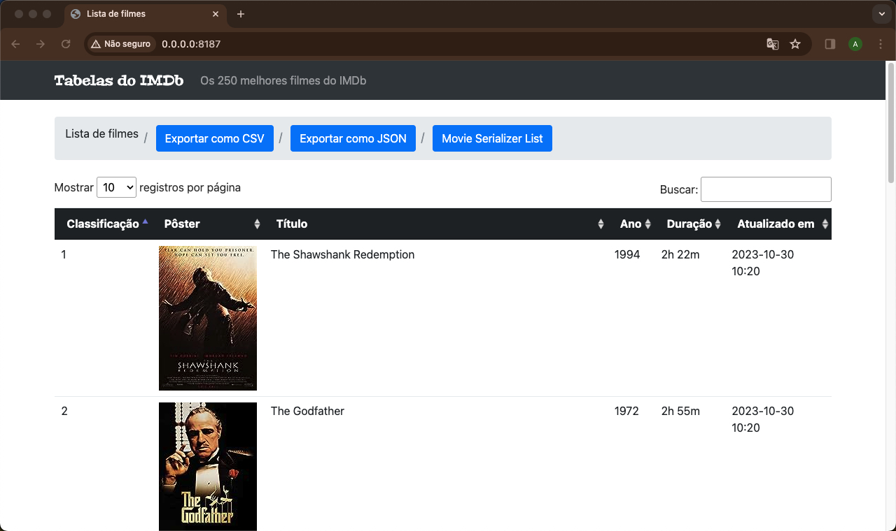
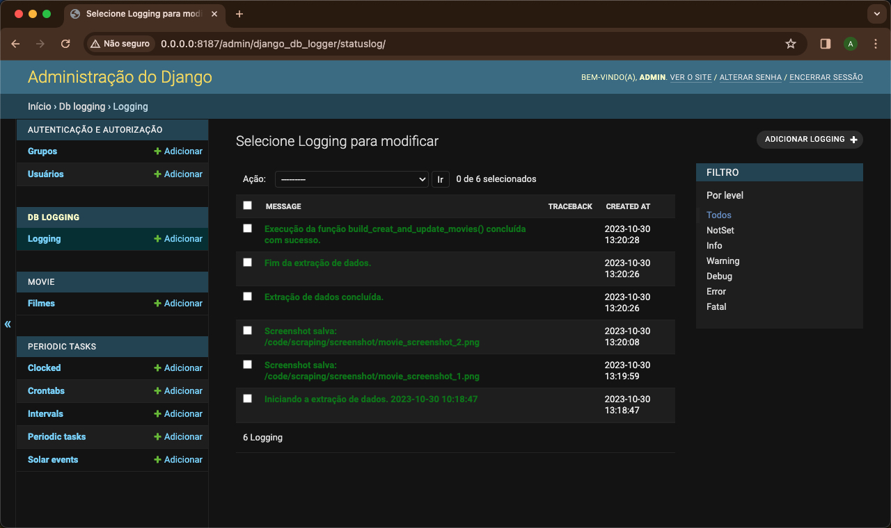

---

# Desafio beeMôn

Este é um desafio proposto pela beeMôn.

## Descrição do Projeto

O projeto tem como objetivo criar uma aplicação que realize a sincronização de informações sobre filmes, coletando dados a partir de uma fonte externa, utilizando técnicas de web scraping. A aplicação é responsável por buscar informações sobre produtos de um site específico, processar esses dados e armazená-los em um banco de dados.

## Tecnologias Utilizadas

Para alcançar esse objetivo, foram utilizadas as seguintes tecnologias:

  - Python
  - Django
  - Django REST Framework
  - PostgreSQL
  - Celery
  - Redis
  - Docker
  - Pandas
  - Requests
  - BeautifulSoup

## Instalação e Uso

Para instalar e executar o projeto, siga as etapas abaixo:

1. Clone o repositório para a sua máquina local:

   ```shell
   git clone git@github.com:AlbertoWagner/desafio-crawler.git
   ```

2. Navegue até o diretório do projeto:

   ```shell
   cd desafio-crawler
   ```

3. Configure as variáveis de ambiente no arquivo `dev.env`. Certifique-se de fornecer informações sensíveis, como chaves de acesso e senhas:

   ```
   SECRET_KEY=django-insecure-o$pcu!s$tbml==0fjfeo%$(92^!13hv#p7qckma)p03_t^*j&z
   DEBUG=True
   SITE_ID=1
   ALLOWED_HOSTS=*
   
   # Configurações do banco de dados PostgreSQL
   DB_NAME=mydatabase
   DB_USER=myuser
   DB_PASSWORD=mypassword
   DB_HOST=db
   DB_PORT=5432
   
   # Configurações do Celery e Redis
   DJANGO_SETTINGS_MODULE=desafio_crawler.settings
   CELERY_BROKER_URL=redis://redis:6379/0
   CELERY_RESULT_BACKEND=redis://redis:6379/0
   
   # Outras configurações
   POSTGRES_HOST_AUTH_METHOD=trust
   POSTGRES_USER=myuser
   POSTGRES_PASSWORD=mypassword
   POSTGRES_DB=mydatabase
   
   # Configurações do superusuário do Django
   DJANGO_SUPERUSER_USERNAME=admin
   DJANGO_SUPERUSER_EMAIL=admin@example.com
   DJANGO_SUPERUSER_PASSWORD=admin
   ```

4. Crie e inicie os contêineres Docker:

   ```shell
   docker-compose up --build
   ```

5. Aguarde até que todos os serviços estejam em execução. Você verá logs indicando o progresso.

6. Acesse a aplicação em seu navegador em http://localhost:8187/.

7. Para carregar as informações iniciais sobre os filmes:

   ```shell
   docker exec -it desafio-crawler-web-1 celery -A desafio_crawler call scraping.tasks.build_create_and_update_movies
   ```

8. Para executar os testes, utilize o seguinte comando:

   ```shell
   docker exec -it desafio-crawler-web-1 python manage.py test
   ```

## REST API

A aplicação disponibiliza uma REST API para acessar e gerenciar informações sobre os filmes. Abaixo estão os principais endpoints da API:

- `GET /serializer/`: Retorna uma lista de filmes.

## Conteúdo

- `GET /`: Retorna uma lista de filmes.



- No painel de administração do Django, é possível acompanhar os registros de tarefas (tasks) realizadas.



## Cron Job

Foi configurado um cron job para executar a sincronização dos dados dos filmes em um horário específico todos os dias, programado para rodar às 23:30.

O objetivo do cron job é buscar os dados dos filmes a partir da fonte externa, processá-los e armazená-los no banco de dados. Isso garante que a base de dados esteja sempre atualizada com as informações mais recentes.

Este projeto foi desenvolvido como parte do desafio proposto pela beeMôn.

<a href="#">
 <sub><b>Alberto Wagner</b></sub></a> <a href="#" ></a>

Feito por Alberto 👋🏽 Entre em contato!

[](https://www.linkedin.com/in/alberto-wagner-5571a3106/)
[](mailto:albertow475@gmail.com)

---
